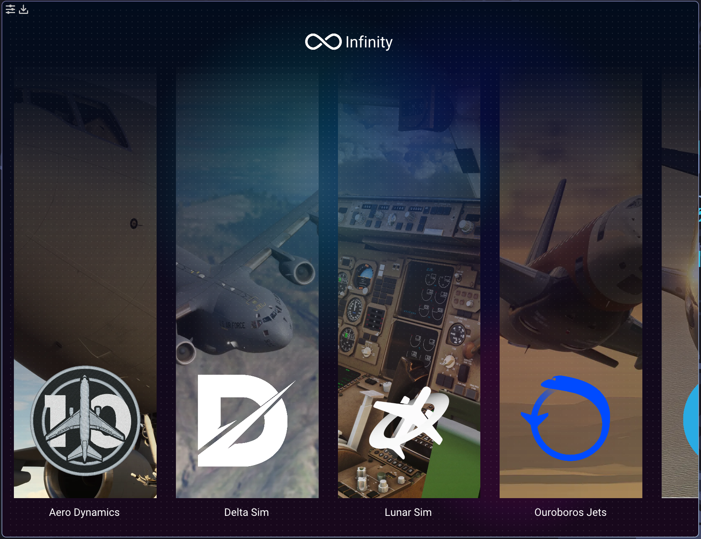
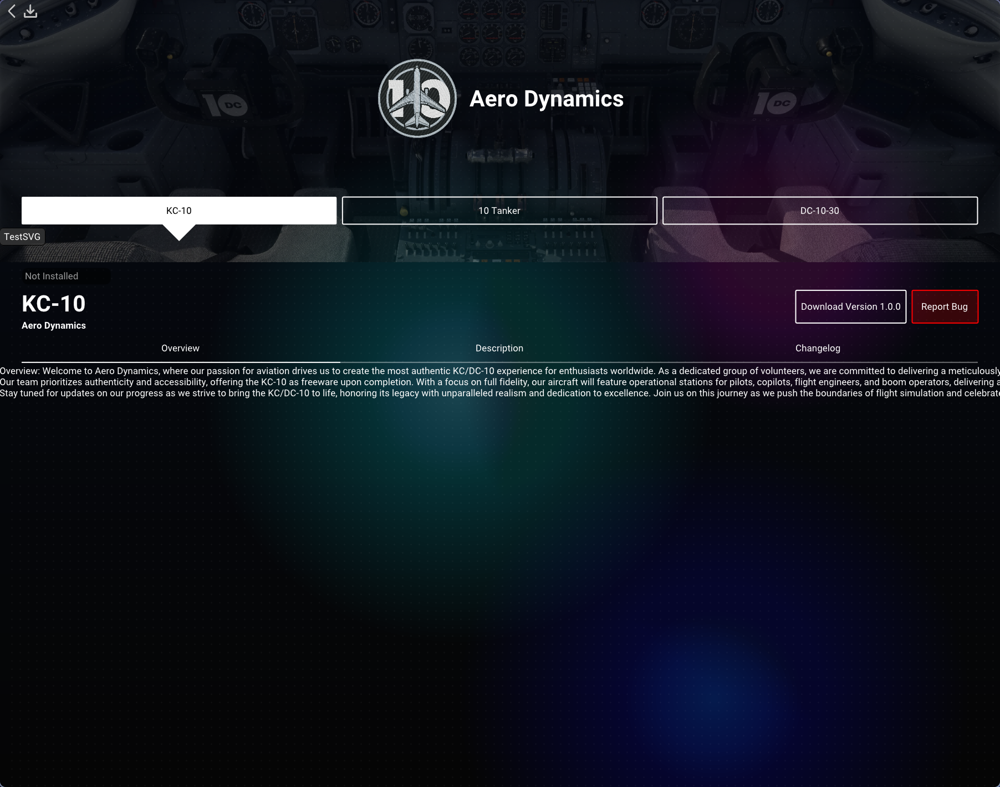

# ✈️ Infinity Launcher

**Infinity Launcher** is a high-performance, OpenGL-powered aircraft downloader and updater for **Microsoft Flight
Simulator
2024.** Built with C++, this launcher is designed to host and manage multiple freeware aircraft,
providing an incredibly clean and responsive user experience—even on ultra-low-spec systems.
___

## 🚀 Features

- 📦 Multi-Aircraft Hosting
  Hosts and manages downloads for major freeware aircraft projects in one unified place.

- 💾 Fragmented Downloads
  Lightning-fast updates using a smart fragmenting system—only the changed pieces are downloaded.

- 🧵 Multithreaded Download Engine
  Fully utilizes all available CPU threads for blistering-fast download speeds.

- 🔒 HWID-Based Access Control
  Secure closed beta support via hardware ID whitelisting, integrated with:

    - Discord bot for automated whitelisting

    - Admin panel for manual overrides

- 🔑 Binary-Key Protected Access
  Some features (like sensitive download links) are encrypted and require a binary hardware key (distributed via
  official Binaries) to function.

  `Note: If you compile from source, restricted-access content will be disabled.`

- 💻 Ridiculously Low Resource Usage
  Runs smooth on literally anything with an OpenGL driver—perfect for potato PCs and high-end rigs alike.

- 🧼 Clean, Minimal UI
  Modern and responsive interface with buttery smooth animations and layout.

___

## 🛠️ Building from Source

Infinity Launcher is **open source**. The code is available to provide transparency into how the platform works.

However, due to security concerns:

- Sensitive download links are encrypted.

- The binary key required to decrypt them is not included.

- You will not be able to access private/restricted content unless you own an official hardware key.

Still, you're free to:

- Build and run your own version

- Audit the code

- Contribute improvements (PRs welcome!)

___

## 📸 Screenshots




___

## 🧠 Tech Stack

- **C++** — Core logic, multithreading, and backend operations

- **OpenGL** — Ultra-lightweight, hardware-accelerated UI

- **Custom Fragmented File Protocol** — Based on HDiffPath for seamless, patch-style updates

___

## 📜 License

This project is open-source under the **GPL-3.0 License**, excluding proprietary binaries used for encryption and PCB
distribution. see [LICENSE](LICENSE) for more details.

___

## 🛠️ Building

### Prerequisites

#### Windows

- Visual Studio 2022 or later (if using the build script) otherwise you can use MINGW
- CMake 3.20 or later
- vcpkg with `VCPKG_ROOT` environment variable set to the vcpkg directory

#### Linux

- GCC 14 or later
- CMake 3.20 or later
- GLEW
- vcpkg with `VCPKG_ROOT` environment variable set to the vcpkg directory

___

### Build Steps

build scripts are provided for both Windows and Linux.

#### Windows

1. Open a terminal and navigate to the project directory.
2. Run the build script:
   ```bash
   .\build.ps1
   ```
3. Follow the build script prompts to configure the build options.

___

#### Linux

1. Open a terminal and navigate to the project directory.
2. Run the build script:
   ```bash
   ./build.sh
   ```
3. Follow the build script prompts to configure the build options.

___

## 🙌 Contributing

Wanna help? Great! Here’s how:

1. Fork the repo

2. Make your changes

3. Submit a PR

We welcome improvements to UI, performance, UX, and security.

___

## 📡 Contact & Support

- Join us on [Discord](https://discord.gg/Rx6h3XPyBf) for support, discussions, and updates.

- Submit issues/requests right here on GitHub!